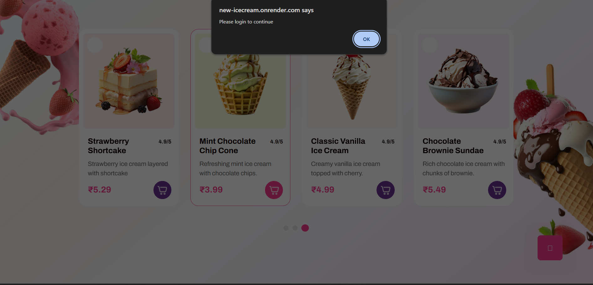
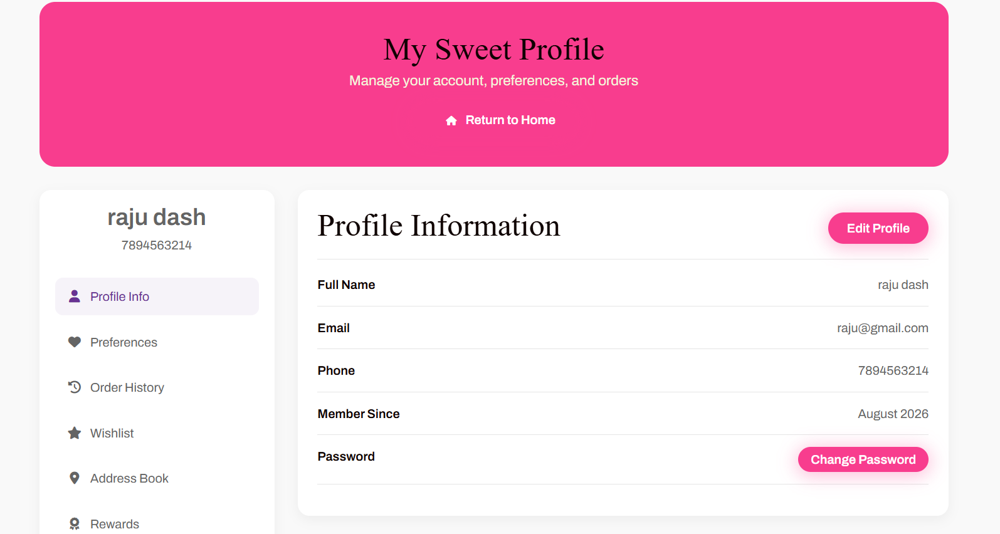
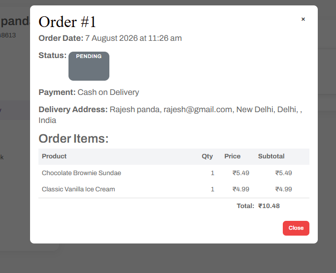
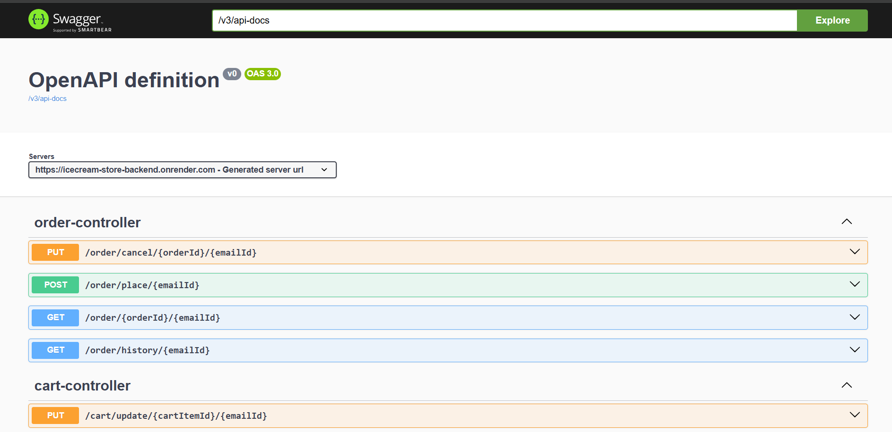

# E-Commerce Backend (Spring Boot)

A REST API backend for an e-commerce application, built with **Spring Boot**, **Spring Security (JWT)**, **Spring JPA / Hibernate**. It covers user authentication, product browsing, cart management, and order placement with full transaction safety.

## Features

- **User Auth** — Register/login with BCrypt password hashing and JWT-based authentication
- **Product Catalog** — Public browsing of products (no login required)
- **Cart Management** — Add, update, remove items; auto-creates cart per user
- **Order Placement** — Cart → Order conversion with stock validation, all wrapped in a DB transaction
- **Order History & Cancellation** — View past orders, cancel pending orders with stock restoration
- **Address Management** — Save delivery addresses per user

## Screenshots

| Home Page | Login Prompt |
|---|---|
|  |  |

| Add to Cart / Checkout | User Profile |
|---|---|
|  |  |

| Order Success | Order History |
|---|---|
|  |  |

**Swagger API Docs**



## Tech Stack

| Layer          | Technology              |
|----------------|--------------------------|
| Language       | Java                     |
| Framework      | Spring Boot              |
| Security       | Spring Security + JWT    |
| Persistence    | Spring Data JPA / Hibernate |
| Database       | (add your DB, e.g. MySQL / PostgreSQL) |

## Architecture

```
Frontend (HTML/JS)
      │
      ▼
Controller  →  Service  →  Repository  →  Database
      │
      ▼
 JWT Auth Filter (validates token on every secured request)
```

## Database Entities

- **UserInformation** — user profile & credentials
- **CartEntity / CartItem** — one cart per user, holding multiple items
- **ProductEntity** — product catalog with stock tracking
- **OrderEntity / OrderItems** — placed orders and their line items
- **UserAddress** — saved delivery addresses

## API Endpoints

### User
| Method | Endpoint | Auth |
|--------|----------|------|
| POST | `/public/user/register` | No |
| POST | `/public/login` | No |
| POST | `/user/change/password/{emailId}` | Yes |
| DELETE | `/delete/user/{emailId}` | Yes |
| POST | `/adress/{emailId}` | Yes |

### Product
| Method | Endpoint | Auth |
|--------|----------|------|
| GET | `/public/products` | No |
| GET | `/public/products/{id}` | No |

### Cart
| Method | Endpoint | Auth |
|--------|----------|------|
| POST | `/cart/add/{emailId}` | Yes |
| GET | `/cart/{emailId}` | Yes |
| PUT | `/cart/update/{cartItemId}/{emailId}` | Yes |
| DELETE | `/cart/item/{cartItemId}/{emailId}` | Yes |
| DELETE | `/cart/clear/{emailId}` | Yes |

### Order
| Method | Endpoint | Auth |
|--------|----------|------|
| POST | `/order/place/{emailId}` | Yes |
| GET | `/order/history/{emailId}` | Yes |
| GET | `/order/{orderId}/{emailId}` | Yes |
| PUT | `/order/cancel/{orderId}/{emailId}` | Yes |

## Key Flow: Placing an Order

1. Find user and their cart
2. Validate stock for every cart item
3. Calculate total amount
4. Create `OrderEntity` and `OrderItems`
5. Reduce product stock
6. Clear the cart
7. Return order confirmation

All of this runs inside a single `@Transactional` block — if any step fails, everything rolls back so the database never ends up in a half-updated state (e.g., stock reduced but order not saved).

## Authentication Flow

1. User logs in → server validates credentials → JWT is generated and returned
2. Frontend stores the JWT (localStorage) and sends it as `Authorization: Bearer <token>` on every secured request
3. A security filter validates the token on each request before allowing access to the controller

## API Documentation

Interactive Swagger UI is available at `/v3/api-docs` (OpenAPI 3.0), listing all controllers (order, cart, product, user) with request/response schemas.

## Getting Started

```bash
# Clone the repo
git clone <your-repo-url>

# Configure your database in application.properties

# Run the application
./mvnw spring-boot:run
```

## Future Improvements

- Payment gateway integration (currently Cash on Delivery only)
- Order tracking / status updates
- Admin panel for managing products and orders
